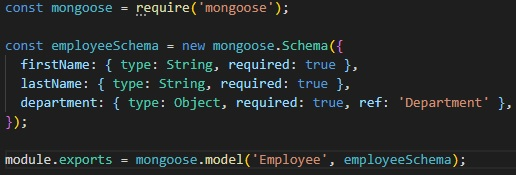

<p align="center">
<a href="https://github.com/grzegorz-jodlowski/mongo-company-app"></a>
</p>


# <p align="center">🏤 Company app</p>
<p align="center">Project for learning MongoDB</p>

</br>

## Table of Contents

- [What's this project about?](#about)
- [Technologies used](#tech)
- [What I learned?](#what)
- [Interesting code snippet](#what)
- [Installation and quick start](#install)
- [NPM scripts](#npmscripts)

</br>

## <a name="about"></a>What's this project about?

T

</br>

## <a name="tech"></a>Technologies used
- JavaScript
- Express
- MongoDB
- MongoDB Atlas
- Mongoose
- GIT

</br>

## <a name="what"></a>What I learned?

- w [Express.js](https://expressjs.com/)


</br>

## <a name="interesting"></a>Interesting code snippet (for me of course 😉)
- e:

```js

```

</br>

## <a name="install"></a>Installation and quick start

- use the package manager [npm](https://www.npmjs.com/get-npm) or [yarn](https://classic.yarnpkg.com/en/) to install dependencies:

```bash
npm install // yarn install

or

npm i // yarn
```
- run server with nodemon (after nodemon installation):

```bash
npm start

or

yarn start
```

## <a name="npmscripts"></a>NPM scripts

There are 3 main scripts to speed up work:

- `start`: run server with nodemon,
- `test`: run tests once,
- `test:watch`: start watch mode for tests,

</br>
</br>

  *project implemented as part of the 9-month [Web Developer Plus](https://kodilla.com/pl/bootcamp/webdeveloper/?type=wdp&editionId=309) course organized by [Kodilla](https://drive.google.com/file/d/1AZGDMtjhsHbrtXhRSIlRKKc3RCxQk6YY/view?usp=sharing)


